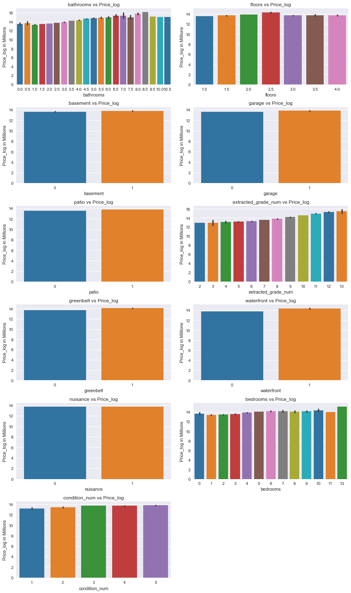

# Real Estate Home Analysis using Linear Regression 

**Author:** Cristopher Delgado

**Blog:** TBD

**Date:** July 2023
## Overview
This project was completed as part of the Flatiron School Curriculum for Data Science Phase 2 Scientific Computing and Quantitative Methods. 

King County is located in the United States of America in Washington. The economy is dependent of commerce success which suggets high cash flow. A big contribution to this cash flow is real estate. Real Estate is known to have big success for people that dedicate themselves to buying homes and reselling them at a higher value. Real Estate also attempts to provide the best home for there customers and their needs if there customer is interested in buying a home. Real Estate agencies also provide service for those that are wishing to sell a home. This suggets that Real Estate agencies need predictive models to make informed decisions based on the market trends for their buyer/seller. 

The objective of this project is to perform data visualization to display trends in home values with respect to home features. This project also includes a linear regresssion models to predict the percentage increase of a home value. 

Overall the investigated features of a home were the following:
* `id` - Unique identifier for a house
* `date` - Date house was sold
* `price` - Sale price (prediction target)
* `bedrooms` - Number of bedrooms
* `bathrooms` - Number of bathrooms
* `sqft_living` - Square footage of living space in the home
* `sqft_lot` - Square footage of the lot
* `floors` - Number of floors (levels) in house
* `waterfront` - Whether the house is on a waterfront
  * Includes Duwamish, Elliott Bay, Puget Sound, Lake Union, Ship Canal, Lake Washington, Lake Sammamish, other lake, and river/slough waterfronts
* `greenbelt` - Whether the house is adjacent to a green belt
* `nuisance` - Whether the house has traffic noise or other recorded nuisances
* `view` - Quality of view from house
  * Includes views of Mt. Rainier, Olympics, Cascades, Territorial, Seattle Skyline, Puget Sound, Lake Washington, Lake Sammamish, small lake / river / creek, and other
* `condition` - How good the overall condition of the house is. Related to maintenance of house.
  * See the [King County Assessor Website](https://info.kingcounty.gov/assessor/esales/Glossary.aspx?type=r) for further explanation of each condition code
* `grade` - Overall grade of the house. Related to the construction and design of the house.
  * See the [King County Assessor Website](https://info.kingcounty.gov/assessor/esales/Glossary.aspx?type=r) for further explanation of each building grade code
* `heat_source` - Heat source for the house
* `sewer_system` - Sewer system for the house
* `sqft_above` - Square footage of house apart from basement
* `sqft_basement` - Square footage of the basement
* `sqft_garage` - Square footage of garage space
* `sqft_patio` - Square footage of outdoor porch or deck space
* `yr_built` - Year when house was built
* `yr_renovated` - Year when house was renovated
* `address` - The street address
* `lat` - Latitude coordinate
* `long` - Longitude coordinate

## Buisness Understanding
The stakeholder in this project is a real estate agency that helps homeowners buy and/or sell homes. A Real Estate Agency would like insghts for the home market being the King County. 

## Buisness Problem
**Stakeholder:** Real Estate Agency

The stakeholder would like advice to provide homeowners information about how home renovations might increase the estimated value of their homes, and by what amount if they are wishing to sell a home. If a homeowner wants to buy a home the agency can provide advice to look for homes within their budget.  

## Data Exploration
### Methodology:
1. Perform data cleaning which consisted of changing data types to approprate/expected types.
2. Normalize data and linearize continous data accordingly.
3. Perform exploratory data analysis to understand the correlations of the features with the price of a home. 
4. Take on an iterative approach to creating prediction models using Linear Regression. 
### Part 1: Data Preparation
* Cast columns to appropriate data types.
* Identify and remove null records as well as duplicated records.
* Normalize continous data to remove outliers and convert it back to original values. 
* Linearize continous data using Log transformation. 
* Extract zipcode and encode the zipcode so we only have unique records. Allows us to consider location as a feature.

Normalized Data and removed Outliers:

### Part 2: Visualizations
* Create interaction scatterplots using the categorical variables to see behavior in price vs a feature that is not categorical. 
* View bar graphs for categorical variables with the heights corresponding to price.
* View correlations with price for both continuous and categorical variables.
* Create heatmap uisng long and lat and the interaction being price. 

Categoricals vs Price_log:

### Part 3: Preparing Categorical Data for Modeling
* One hot encode all categorical variables.
* Check for multlicollinearity within features and drop columns accordingly. 
## Summary of Findings

## Model Sumamry
| Model   | Description                                | Num of Features | r^2 | Accuracy | Mean Squared Err  | Normality | Homoscedasticity | 
|:--------|:-------------------------------------------|:----------------|:----|:---------|:------------------|:----------|------------------|
| Model 1 | All features                               |       111       |0.697| 69.70%   |0.10176505179945569| Fail      | Fail             |
| Model 2 | All features w/categorical outliers removed|       111       |0.665| 66.50%   |0.09990739278487029| Fail      | Fail             |
| Model 3 | Top 4 features correlated with price_log   |       4         |0.441| 44.10%   |0.09990739278487029| Fail      | Fail             |
### Model Normality and Homoscedasticity
**Model 1:**

Model 1 fails the normality check as the sample data differs significantly from the predicted data for high and low price_log values. This suggets that the model can't accurately predict percent changes in price if there high or low values. There is a section where the model can predict accurante percent changes which is where it follows closely to the red line. 

The generated predicted values are scattered in a random fashion as well as clustered in a certain range of predicted values up until the model predicts higher values. Unfortunately this suggets that the model does not show random scatter of points forming an approximately constant width band around the reference line. Overall this model is not appropriate for the data. 

**Model 2:** 

Model 2 fails the normality check as the sample data differs significantly from the predicted data for high and low price_log values. This suggets that the model can't accurately predict percent changes in price if there high or low values. There is a section where the model can predict accurante percent changes which is where it follows closely to the red line. 

The generated predicted values are scattered in a random fashion as well as clustered in a certain range of predicted values up until the model predicts higher values. Unfortunately this suggets that the model does not show random scatter of points forming an approximately constant width band around the reference line. Overall this model is not appropriate for the data. 

**Model 3:** 

Model 3 fails the normality check as the sample data differs significantly from the predicted data for high and low values. Removing features did shorten the tails for the normality check. Most of the features removed were zipcodes. There is a section where the model can predict accurante percent changes which is where it follows closely to the red line. 

The generated predicted values are scattered in a random fashion as well as clustered in a certain range of predicted values up until the model predicts higher values. Unfortunately this suggets that the model does not show random scatter of points forming an approximately constant width band around the reference line. Overall this model is not appropriate for the data. 

#### 
## Conclusion

