# Real Estate Home Analysis using Linear Regression 

**Author:** Cristopher Delgado

**Blog:** TBD

**Date:** July 2023
## Overview
This project was completed as part of the Flatiron School Curriculum for Data Science Phase 2 Scientific Computing and Quantitative Methods. 

King County is located in the United States of America in Washington. The U.S economy is dependent of on the success of commerce, which suggets high cash flow. About seventy percent of the U.S Gross Domestic Product (GDP) compromises of consumer spending (Amadeo, 2022). A big contribution to this cash flow is real estate as real estate contributes to consumer spending and composed about nine percent of the GDP (Amadeo, 2021). 

This project considers its stakeholder as a Real Estate agency. This agency provides services for those that are wishing to sell a home or but a home. This suggets that the agency needs a predictive model to make informed decisions based on the market trends for their buyer/seller in their location being 'King County'.  

The objective of this project is to perform data visualization to display trends in home values with respect to home features for the listings between 2021-2022. This project also includes linear regression models to predict the home value using features in the data set included in this repository. 

Overall the investigated features of a home were the following in the King County dataset:
* `id` - Unique identifier for a house
* `date` - Date house was sold
* `price` - Sale price (prediction target)
* `bedrooms` - Number of bedrooms
* `bathrooms` - Number of bathrooms
* `sqft_living` - Square footage of living space in the home
* `sqft_lot` - Square footage of the lot
* `floors` - Number of floors (levels) in house
* `waterfront` - Whether the house is on a waterfront
  * Includes Duwamish, Elliott Bay, Puget Sound, Lake Union, Ship Canal, Lake Washington, Lake Sammamish, other lake, and river/slough waterfronts
* `greenbelt` - Whether the house is adjacent to a green belt
* `nuisance` - Whether the house has traffic noise or other recorded nuisances
* `view` - Quality of view from house
  * Includes views of Mt. Rainier, Olympics, Cascades, Territorial, Seattle Skyline, Puget Sound, Lake Washington, Lake Sammamish, small lake / river / creek, and other
* `condition` - How good the overall condition of the house is. Related to maintenance of house.
  * See the [King County Assessor Website](https://info.kingcounty.gov/assessor/esales/Glossary.aspx?type=r) for further explanation of each condition code
* `grade` - Overall grade of the house. Related to the construction and design of the house.
  * See the [King County Assessor Website](https://info.kingcounty.gov/assessor/esales/Glossary.aspx?type=r) for further explanation of each building grade code
* `heat_source` - Heat source for the house
* `sewer_system` - Sewer system for the house
* `sqft_above` - Square footage of house apart from basement
* `sqft_basement` - Square footage of the basement
* `sqft_garage` - Square footage of garage space
* `sqft_patio` - Square footage of outdoor porch or deck space
* `yr_built` - Year when house was built
* `yr_renovated` - Year when house was renovated
* `address` - The street address
* `lat` - Latitude coordinate
* `long` - Longitude coordinate

## Buisness Understanding
The stakeholder in this project is a real estate agency that helps homeowners buy and/or sell homes. A Real Estate Agency would like insghts for the home market being the King County. 

## Buisness Problem
**Stakeholder:** Real Estate Agency

The stakeholder would like advice to provide homeowners information about how home renovations might increase the estimated value of their homes, and by what amount if they are wishing to sell a home. If a homeowner wants to buy a home the agency can provide advice to look for homes within their budget.  

## Data Exploration
### Methodology:
1. Perform data cleaning which consisted of changing data types to approprate/expected types.
2. Normalize data and linearize continous data accordingly.
3. Perform exploratory data analysis to understand the correlations of the features with the price of a home. 
4. Take on an iterative approach to creating prediction models using Linear Regression. 
### Part 1: Data Preparation
* Cast columns to appropriate data types.
* Identify and remove null records as well as duplicated records.
* Normalize continous data to remove outliers and convert it back to original values. 
* Linearize continous data using Log transformation. Log transformation allows for easier visualization and data compression due to homogenizing the variance in the continous data. This will allow for easier feature comparisons. 
* Extract zipcode and encode the zipcode so we only have unique records. Allows us to consider location as a feature.

Normalized Data and removed Outliers:

### Part 2: Visualizations
* Create interaction scatterplots using the categorical variables to see behavior in price vs continous features. 
* View bar graphs for categorical variables with the heights corresponding to price.
* View correlations with price for both continuous and categorical variables. 

#### Feature Influences: 

**The main takeaways:**
> Basement:
> * Homes with a basement can increase a homes value in comparison to those without a basement according to the bar graph. It is not a consistent indicator that a home with a basement would outcompete a home without a basement depicted through the interaction graphs. 

> Garage:
> * Homes with a garage can increase a homes value in comparison to those without a basement. It is not a consistent indicator that a home with a garage would outcompete a home without a garage depicted through the interaction graphs. 

> Patio: 
> * Homes with a patio can increase a homes value in comparison to those without a basement. It is not a consistent indicator that a home with a patio would outcompete a home without a patio depicted through the interaction graphs. 

> Floors:
> * Floors can increase a homes up until 2.5 floors. After 2.5 floors there is a deacrease in a homes value. This can be seen through the bar graph as well as the interaction graph. 

> Grade Number:
> * The grade number does show a consistent indication that when the quality of the house is better the price increases as a reasult. This behavior can be seen in both the bar graph and interaction graph. 

> Greenbelt, Waterfront, and Nuisance : 
> * All three of these features demonstrate a very small amount of correlation to increase a homes value. The disparity in comparing homes with and without these features is high. According to the bar graphs when the feature is present the price of the home increases as a result. 

> Bedrooms:
> * Bedrooms does show consistent increase a homes price as bedrooms increase in a home. This behavior is depicted in the bar graph as well as the interaction graph.

> Condition Number:
> * Condition number does not show a consistent indication that a home can increase a homes price according to the interaction graph. There are homes with better conditions that are valued less than homes with worse conditions. Using the bar graph it is easier to determine that when the condition of a home increases the home value does as well. 

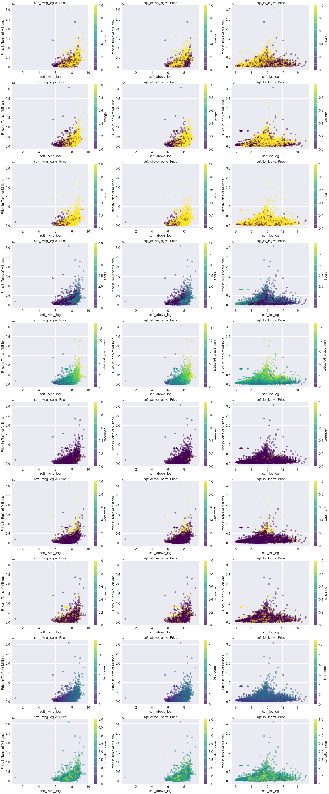

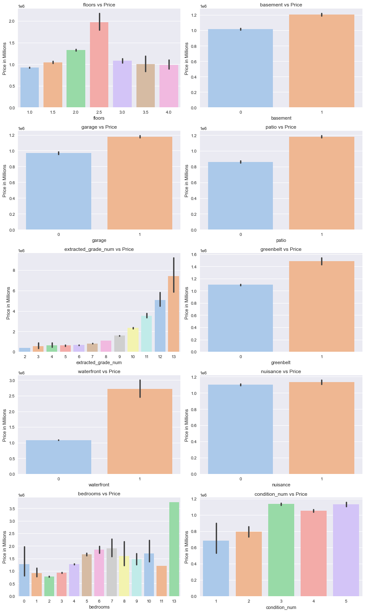
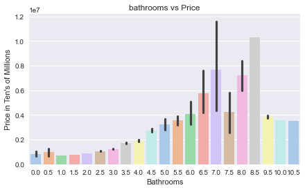

### Part 3: Preparing Categorical Data for Modeling
* One hot encode all categorical variables.
* Check for multlicollinearity within features and drop columns accordingly. 

#### Multicollinearity Detection: 
Multicollinearity occurs when features are correlated with eachother within the range of .75 through 1. Multicollinearity can affect model predictions in terms of inflating standard errors of regression coefficients. This as a result, creates less reliable predictions. If a model uses features that depend on eachother, then this violates the assumption of independent features which is assumed for linear regression because if featuires are not independent there is no way to determine which features truly driove the changes in the target variable. 

The pairs of features that demonstrate multicollinearity are:
|Feature Pair                     |CC      |
|:--------------------------------|:-------|
|sqft_living_log, sqft_above_log  |0.874526|
|sqft_living_log, bathrooms       |0.762857|

## Summary of Findings

## Model Summary
| Model   | Description                                                                              | Num of Features | r^2 | Accuracy | Root Mean Square Err (RMSE)  | RMSE Interpretation                                                                      | Normality | Homoscedasticity | 
|:--------|:-----------------------------------------------------------------------------------------|:----------------|:----|:---------|:-----------------------------|:-----------------------------------------------------------------------------------------|:----------|------------------|
| Model 1 | All features with continuous variables log transformed                                   |       351       |0.697| 69.70%   |0.32018251682706217           |Model Predictions are off by a factor of 1.38 times the actual price.                     |Fail       |Fail              |
| Model 1a| All features and outliers 2 standard deviations away removed                             |       102       |0.611| 61.10%   |0.30038837634144505           |Model Predictions are off by a factor of 1.35 times the actual price.                     |Fail       |Fail              |
| Model 1b| All features and outliers 1 standard deviation away removed                              |       84        |0.668| 66.80%   |0.21045350813759633           |Model Predictions are off by a factor of 1.23 times the actual price.                     |Fail       |Fail              |
| Model 2 | All features but only includes log transformaion of price                                |       105       |0.690| 69.00%   |0.3235489641256842            |Model Predictions are off by a factor of 1.38 times the actual price.                     |Fail       |Fail              |
| Model 2a| Same as Model 2 and outliers 2 standard deviations away removed                          |       99        |0.680| 68.00%   |0.30146469009917887           |Model Predictions are off by a factor of 1.35 times the actual price.                     |Fail       |Fail              |
| Model 2b| Same as Model 2 and outliers 1 standard deviations away removed                          |       78        |0.662| 66.20%   |0.21255222369534896           |Model Predictions are off by a factor of 1.24 times the actual price.                     |Fail       |Fail              |
| Model 3 | Top 4 features correlated with price_log                                                 |       4         |0.410| 41.00%   |0.4471105062962519            |Model Predictions are off by a factor of 1.56 times the actual price.                     |Fail       |Fail              |
| Model 3a| Same as Model 3 and outliers 2 standards deviations away removed                         |       4         |0.248| 24.80%   |0.41862258620994197           |Model Predictions are off by a factor of 1.52 times the actual price.                     |Fail       |Fail              |
| Model 4 | All continuous variables not log transformed and polynomial transformation (x^2)         |       88        |0.639| 63.90%   |537578.2645135914             |Model Predictions are off by 537578.26 dollars off the actual price.                      |Fail       |Fail              |
| Model 4a| Same as Model 4 and outliers 2 standard deviations away removed                          |       108       |0.670| 67.00%   |253072.0173309085             |Model Predictions are off by 253072.02 dollars off the actual price.                      |Fail       |Fail              |
| Model 4b| Same as Model 4 and outliers 1 standard deviation away removed                           |       75        |0.654| 65.40%   |192922.65451183027            |Model Predictions are off by 192922.65 dollars off the actual price.                      |Fail       |Fail              |

### Model Normality and Homoscedasticity
**Model 1:**

Model 1 fails the normality check as the sample data differs significantly from the predicted data for high and low price percent changes. This suggets that the model still has significant outliers. This model explains about 70% of the variance found in price_log. The model predictions are off by a factor of 1.38 times the actual price. 

The generated predicted values are scattered in a random fashion as well as clustered in a certain range of predicted values up until the model predicts higher values. Unfortunately this suggets that the model does not show random scatter of points forming an approximately constant width band around the reference line. Overall this model is not appropriate for the data. 

**Model 1a:**

Model 1a fails the normality check as the sample data differs significantly from the predicted values. This model only has one tail that deviates significantly from the reference normal line as seen on the Q-Q plot. This suggest that the model still has significant outliers. The model explains about 61% of the variance found in price_log. The model predictions are off by a factor of 1.35 times the actual price. 

The generated values are scattered in a random fashion as well as clustered in a certain range. This range is very small as both the ends of small and large predicted values narrow down towards the reference line in the residual plot. Overall this model is not great in predicting high or low price_log values. 

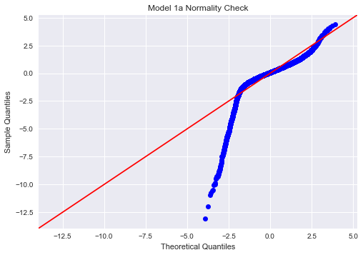
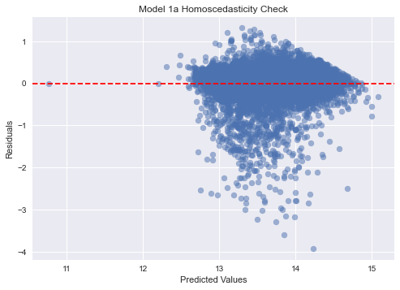

**Model 1b:** 

Model 1b fails the normality check as the sample data differs moderatly from the predicted values. This model only has one tail that deviates significantly from the reference normal line as seen on the Q-Q plot. This suggest that the models still has significant outliers. This model explains about 67% of the variance found in price_log. The model predictions are off by a factor of 1.23 times the actual price. 

The generated predicted values are scattered in a random fashion as well as clustered in a certain range of predicted values up until the model predicts higher values. Unfortunately this suggets that the model does not show random scatter of points forming an approximately constant width band around the reference line. Overall this model is not appropriate for the data. 

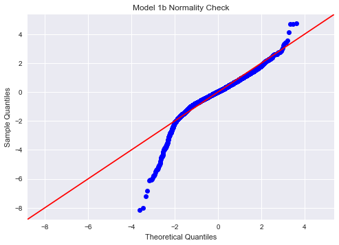
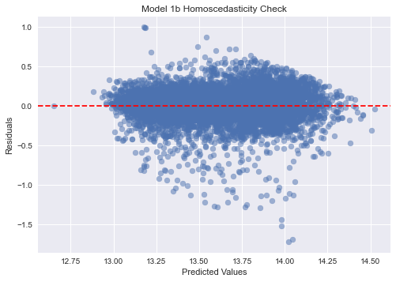

**Model 2:**

Model 2 fails the normality check as the sample data differs significantly from the predicted data for high and low price_log values. This model has two tails that deviates significantly from the reference normal line as seen on the Q-Q plot. This suggest that the model still has significant outliers. The model explains about 69% of the variance found in price_log. The model predictions are off by a factor of 1.38 times the actual price.

The generated predicted values are scattered in a random fashion as well as clustered in a certain range of predicted values up until the model predicts higher and lower values. Unfortunately this suggets that the model does not show random scatter of points forming an approximately constant width band around the reference line. Overall this model is not appropriate for the data. 

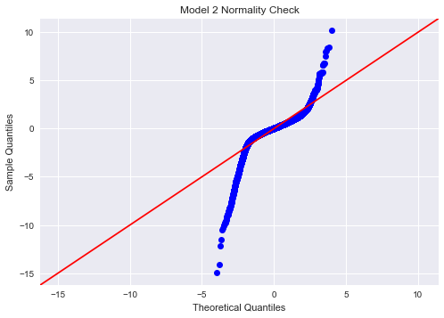
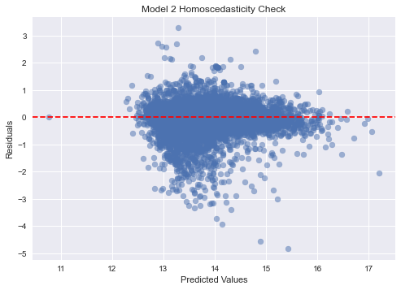

**Model 2a:** 

Model 2a fails the normality check as the sample data differs significantly from the predicted data for high and low price_log values. This model has 1 tail that deviates significantly from the reference normal line as seen on the Q-Q plot. This suggest that the model still has significant outliers. The model explains about 68% of the variance found in price_log. The model predictions are off by a factor of 1.35 times the actual price. 

The generated predicted values are scattered in a random fashion as well as clustered in a certain range of predicted values up until the model predicts higher values. Unfortunately this suggets that the model does not show random scatter of points forming an approximately constant width band around the reference line. Overall this model is not appropriate for the data.

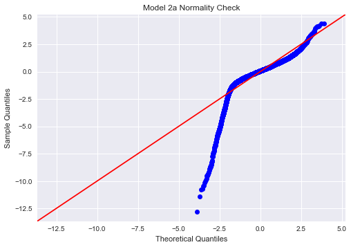
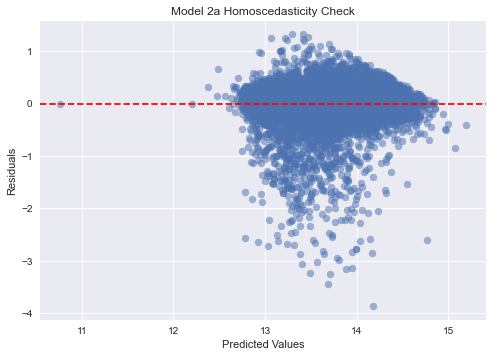

**Model 2b:** 

Model 2b fails the normality check as the sample data differs moderatly from the predicted data for high and low price_log values. This model has 1 tail that deviates significantly from the reference normal line as seen on the Q-Q plot. This suggest that the model still has significant outliers. The model explains about 66% of the variance found in price_log. The model predictions are off by a factor of 1.24 times the actual price. 

The generated predicted values are scattered in a random fashion as well as clustered in a certain range of predicted values up until the model predicts higher and lower values. Unfortunately this suggets that the model does not show random scatter of points forming an approximately constant width band around the reference line. Overall this model is not appropriate for the data.

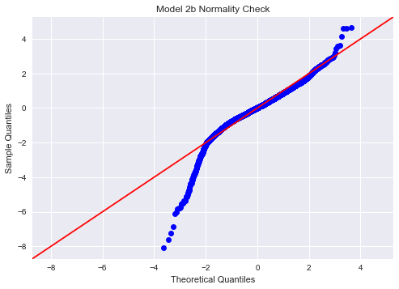
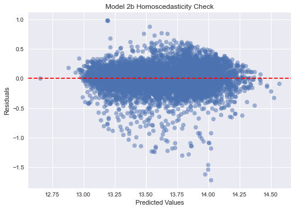

**Model 3:** 

Model 3 considers only the top 4 features. In doing so, this model can be considered as a simple model. Removing features did shorten the tails for the normality check. This model still has significant outliers. The model describes about 40% of the variance found in price_log. The model predictions are off by a factor of 1.56 times the actual price. 

The generated predicted values are scattered in a random fashion as well as clustered in a certain range of predicted values up until the model predicts higher and low values. Unfortunately this suggets that the model does not show random scatter of points forming an approximately constant width band around the reference line. Overall this model is not appropriate for the data. 

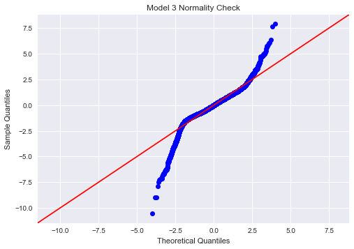

**Model 3a:**
Model 3 considers only the top 4 features in addition to removing outlier 2 standard deviations away from the mean. Removing features and outliers did shorten the tails for the normality check. In fact one entire tail is missing in comparison to the original Model 3. This model still has significant outliers since one tail is still present. The model describes about 25% of the variance found in price_log. The model predictions are off by a factor of 1.52 times the actual price. 

The generated predicted values are scattered in a random fashion as well as clustered in a certain range of predicted values up until the model predicts higher and low values. This model has the been the only model to get close to not being Heteroscedastic. Unfortunately this suggets that the model does not show random scatter of points forming an approximately constant width band around the reference line. Overall this model is not appropriate for the data. 

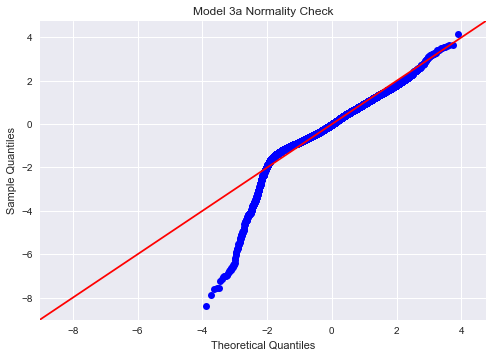
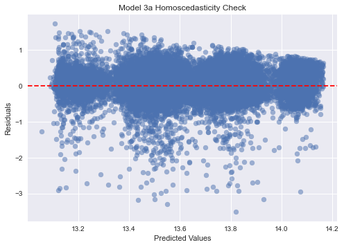

**Model 4:**

Model 4 considers a polynomial (x^2) approach to the continous features in the data. That being said the interpretability of this model is much simpler than any of the previous models since none of the continous features have been log transformed. This model still has significant outliers since its Q-Q plot contains two tails. The model explains about 64% of the variance found in price. The model predictions are off by 537578.26 dollars off the actual price.

The generated predicted values are scattered in a random fashion as well as clustered in a certain range of predicted values up until the model predicts low values. Unfortunately this suggets that the model does not show random scatter of points forming an approximately constant width band around the reference line. Overall this model is not appropriate for the data. 

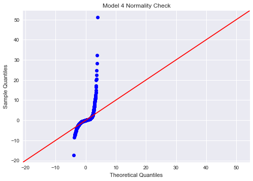
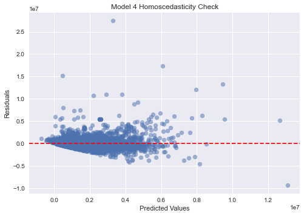

**Model 4a:**

Model 4a considers a polynomial (x^2) approach to the continous features in the data. This model removes outliers beyond 2 standard deviations away from the mean. That being said the interpretability of this model is much simpler than any of the previous models since none of the continous features have been log transformed. This model still has significant outliers since its Q-Q plot contains two tails. This model is closer to normality in comparison to its original model 4. The model explains about 67% of the variance found in price. The model predictions are off by 253072.02 dollars off the actual price.

The generated predicted values are scattered in a random fashion as well as clustered in a certain range of predicted values up until the model predicts high and low values. Unfortunately this suggets that the model does not show random scatter of points forming an approximately constant width band around the reference line. Overall this model is not appropriate for the data. 

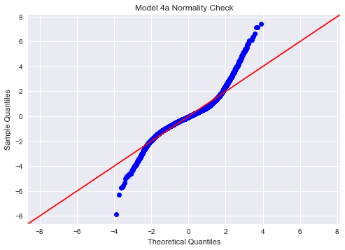
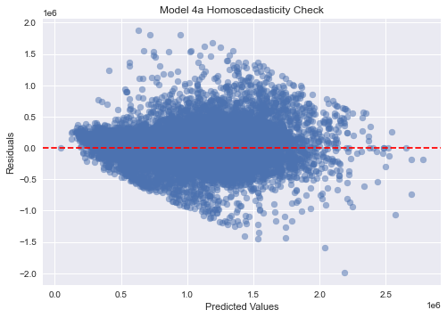

**Model 4b:**

Model 4b considers a polynomial (x^2) approach to the continous features in the data. This model removes outliers beyond 1 standard deviation away from the mean. That being said the interpretability of this model is much simpler than any of the previous models since none of the continous features have been log transformed. This model still has significant outliers since its Q-Q plot contains two tails. This model is closer to normality in comparison to its original model 4. The model explains about 65% of the variance found in price. The model predictions are off by 192922.65 dollars off the actual price.

The generated predicted values are scattered in a random fashion as well as clustered in a certain range of predicted values up until the model predicts high and low values. Unfortunately this suggets that the model does not show random scatter of points forming an approximately constant width band around the reference line. Overall this model is not appropriate for the data. 

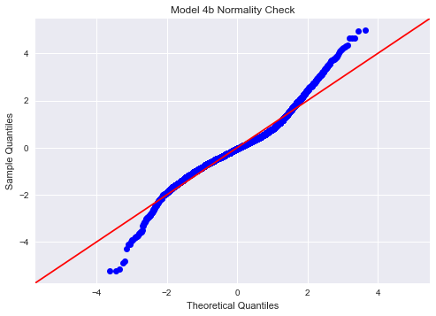
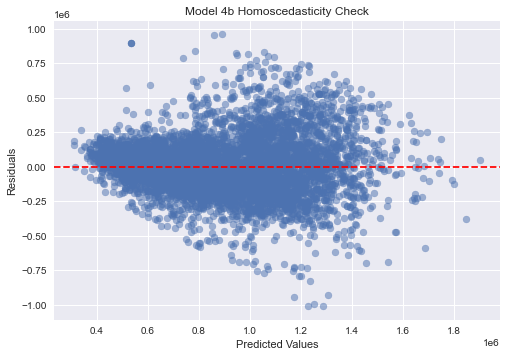

## Insights 
#### Best Predictive Features: 
* Grade Number, Square Footage of the Home (sqft_above_log), Bathrooms, Bedrooms are the highest correlated with price. These features make up for 40% of the variance in the taregt variable price. Adding on when you consider the location of a home it can potentially increase to about 70% of the variance in price. All of the features that include aspects of a home such as sqft or bathrooms, bedrooms, garage, etc are positive coefficients in the models. However, when you factor in a homes location, it can negatively impact a homes value. Location is an imporatnt factor to consider for home. 

## Conclusion

Result Suggestions:
* **Location can make up for most of the price in a home's value.** Without the information on location the predictability is impacted significantly. An example is a home with the presence of 'waterfront'. When waterfront is present the homes value does increase. The same thing can be said about the feature 'greenbelt'. Zipcode does matter as there are homes around a waterfront or greenbelt or simply in different locations that can impact a home's value negatively or positively. 
* **Home aspects such as bedrooms, bnathrooms, and square footage matter.** The Square footage of the home (sqft_above) is moderetly correlated with price. Features such as beds, baths, and floors increases home's value and thus higher sell value. When adding more features it can increase the home's value however do not overdo it as there are points where increasing features like start to make no difference.  
* **A home's construction and state matter.** A condition of 3 and above as well as a grade of 8 and above increases a home's value. The qaulity and condition of a home can impact resale value. This means that renovation can impact a home's value. 
* **The model I would suggest for usage despite all models failing normality and homoscedasticity would be model 4b.** Model 4b has an easy interpretation for predicted price values. Since this dataset has a big skew for certain features of a home such as no presence of a waterfornt, and zipcode this model was narrowed down to represent only 68% of the sample to accomadate that issue. That being said because of this accomadation the skew and outliers were removed and the data was close to achieving normality and homoscedasticity. The erro of this model is not huge either in comparison to the other models. The other include linearized data and yet achieving normality and homoscedasticity was still not accomplished in addition to also removing outliers. The other models have difficlut interpretations because of their log transformed features. 

**Find other model coeficient graphs in modeling notebook**

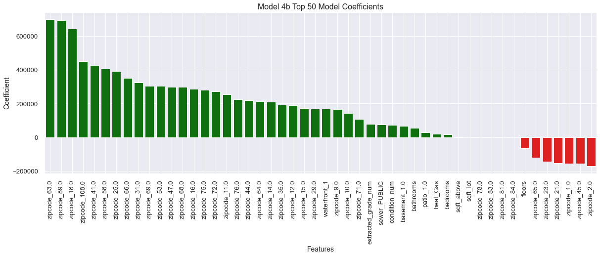

Future Work: 
* Obtain more records around King County so we can truly observe how location can impact price. Due to such a small sample size and overwheling majority of homes not being next to a waterfront, the correlation between waterfront and price does not represent the fact where those homes did sell for more. We would need more records to compare homes away and next to a waterfront to truly see how zipcode and waterfront can truly make a difference. We only mananged to see a small glimpse of this trend with the current datset. With more records representing most of King County this can improve the models issues with Heterosdasticity and Normality.
* Look into location research aspects such as proximity to schools, entertainment centers, etc. 
* Use machine learning for predictive models.

References: 
1. Amadeo, K. (2022, July 5). How does the U.S. Economy Work?. The Balance. https://www.thebalancemoney.com/how-does-the-us-economy-work-4802698  
2. Amadeo, K. (2021, March 4). Real Estate’s Impact on the US Economy. The Balance. https://www.thebalancemoney.com/how-does-real-estate-affect-the-u-s-economy-3306018  