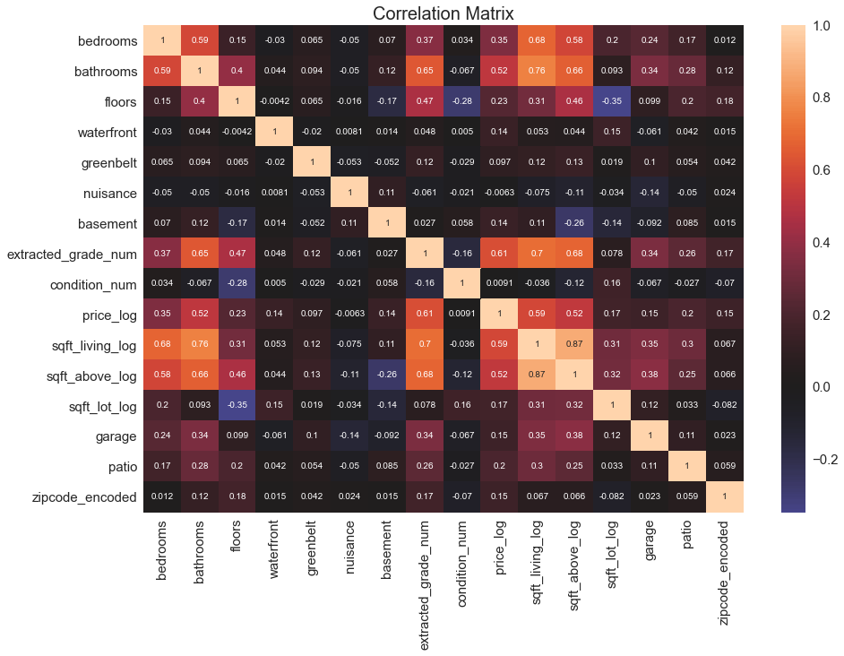

# Real Estate Home Analysis using Linear Regression 

**Author:** Cristopher Delgado

**Blog:** TBD

**Date:** July 2023
## Overview
This project was completed as part of the Flatiron School Curriculum for Data Science Phase 2 Scientific Computing and Quantitative Methods. 

King County is located in the United States of America in Washington. The U.S economy is dependent of on the success of commerce, which suggets high cash flow. A big contribution to this cash flow is real estate. Real Estate is known to have big success for people that dedicate themselves to buying homes and reselling them at a higher value. Real Estate also attempts to provide the best home for there customers and their needs if there customer is interested in buying a home. Real Estate agencies also provide service for those that are wishing to sell a home. This suggets that Real Estate agencies need predictive models to make informed decisions based on the market trends for their buyer/seller. 

The objective of this project is to perform data visualization to display trends in home values with respect to home features. This project also includes a linear regresssion models to predict the percentage increase of a home value. 

Overall the investigated features of a home were the following in the King County dataset:
* `id` - Unique identifier for a house
* `date` - Date house was sold
* `price` - Sale price (prediction target)
* `bedrooms` - Number of bedrooms
* `bathrooms` - Number of bathrooms
* `sqft_living` - Square footage of living space in the home
* `sqft_lot` - Square footage of the lot
* `floors` - Number of floors (levels) in house
* `waterfront` - Whether the house is on a waterfront
  * Includes Duwamish, Elliott Bay, Puget Sound, Lake Union, Ship Canal, Lake Washington, Lake Sammamish, other lake, and river/slough waterfronts
* `greenbelt` - Whether the house is adjacent to a green belt
* `nuisance` - Whether the house has traffic noise or other recorded nuisances
* `view` - Quality of view from house
  * Includes views of Mt. Rainier, Olympics, Cascades, Territorial, Seattle Skyline, Puget Sound, Lake Washington, Lake Sammamish, small lake / river / creek, and other
* `condition` - How good the overall condition of the house is. Related to maintenance of house.
  * See the [King County Assessor Website](https://info.kingcounty.gov/assessor/esales/Glossary.aspx?type=r) for further explanation of each condition code
* `grade` - Overall grade of the house. Related to the construction and design of the house.
  * See the [King County Assessor Website](https://info.kingcounty.gov/assessor/esales/Glossary.aspx?type=r) for further explanation of each building grade code
* `heat_source` - Heat source for the house
* `sewer_system` - Sewer system for the house
* `sqft_above` - Square footage of house apart from basement
* `sqft_basement` - Square footage of the basement
* `sqft_garage` - Square footage of garage space
* `sqft_patio` - Square footage of outdoor porch or deck space
* `yr_built` - Year when house was built
* `yr_renovated` - Year when house was renovated
* `address` - The street address
* `lat` - Latitude coordinate
* `long` - Longitude coordinate

## Buisness Understanding
The stakeholder in this project is a real estate agency that helps homeowners buy and/or sell homes. A Real Estate Agency would like insghts for the home market being the King County. 

## Buisness Problem
**Stakeholder:** Real Estate Agency

The stakeholder would like advice to provide homeowners information about how home renovations might increase the estimated value of their homes, and by what amount if they are wishing to sell a home. If a homeowner wants to buy a home the agency can provide advice to look for homes within their budget.  

## Data Exploration
### Methodology:
1. Perform data cleaning which consisted of changing data types to approprate/expected types.
2. Normalize data and linearize continous data accordingly.
3. Perform exploratory data analysis to understand the correlations of the features with the price of a home. 
4. Take on an iterative approach to creating prediction models using Linear Regression. 
### Part 1: Data Preparation
* Cast columns to appropriate data types.
* Identify and remove null records as well as duplicated records.
* Normalize continous data to remove outliers and convert it back to original values. 
* Linearize continous data using Log transformation. Log transformation allows for easier visualization and data compression due to homogenizing the variance in the continous data. This will allow for easier feature comparisons. 
* Extract zipcode and encode the zipcode so we only have unique records. Allows us to consider location as a feature.

Normalized Data and removed Outliers:

### Part 2: Visualizations
* Create interaction scatterplots using the categorical variables to see behavior in price vs continous features. 
* View bar graphs for categorical variables with the heights corresponding to price.
* View correlations with price for both continuous and categorical variables. 

#### Feature Influences: 

**The main takeaways:**
> Basement:
> * Homes with a basement can increase a homes value in comparison to those without a basement according to the bar graph. It is not a consistent indicator that a home with a basement would outcompete a home without a basement depicted through the interaction graphs. 

> Garage:
> * Homes with a garage can increase a homes value in comparison to those without a basement. It is not a consistent indicator that a home with a garage would outcompete a home without a garage depicted through the interaction graphs. 

> Patio: 
> * Homes with a patio can increase a homes value in comparison to those without a basement. It is not a consistent indicator that a home with a patio would outcompete a home without a patio depicted through the interaction graphs. 

> Floors:
> * Floors can increase a homes up until 2.5 floors. After 2.5 floors there is a deacrease in a homes value. This can be seen through the bar graph as well as the interaction graph. 

> Grade Number:
> * The grade number does show a consistent indication that when the quality of the house is better the price increases as a reasult. This behavior can be seen in both the bar graph and interaction graph. 

> Greenbelt, Waterfront, and Nuisance : 
> * All three of these features demonstrate a very small amount of correlation to increase a homes value. The disparity in comparing homes with and without these features is high. According to the bar graphs when the feature is present the price of the home increases as a result. 

> Bedrooms:
> * Bedrooms does show consistent increase a homes price as bedrooms increase in a home. This behavior is depicted in the bar graph as well as the interaction graph.

> Condition Number:
> * Condition number does not show a consistent indication that a home can increase a homes price according to the interaction graph. There are homes with better conditions that are valued less than homes with worse conditions. Using the bar graph it is easier to determine that when the condition of a home increases the home value does as well. 

### Part 3: Preparing Categorical Data for Modeling
* One hot encode all categorical variables.
* Check for multlicollinearity within features and drop columns accordingly. 

#### Multicollinearity Detection: 
Multicollinearity occurs when features are correlated with eachother within the range of .75 through 1. Multicollinearity can affect model predictions in terms of inflating standard errors of regression coefficients. This as a result, creates less reliable predictions. If a model uses features that depend on eachother, then this violates the assumption of independent features which is assumed for linear regression because if featuires are not independent there is no way to determine which features truly driove the changes in the target variable. 

The pairs of features that demonstrate multicollinearity are:
|Feature Pair                     |CC      |
|:--------------------------------|:-------|
|sqft_living_log, sqft_above_log  |0.874526|
|sqft_living_log, bathrooms       |0.762857|

## Summary of Findings

## Model Sumamry
| Model   | Description                                                                              | Num of Features | r^2 | Accuracy | Root Mean Square Err (RMSE)  | RMSE Interpretation                                                                      | Normality | Homoscedasticity | 
|:--------|:-----------------------------------------------------------------------------------------|:----------------|:----|:---------|:-----------------------------|:-----------------------------------------------------------------------------------------|:----------|------------------|
| Model 1 | All features with continuous variables log transformed                                   |       351       |0.697| 69.70%   |0.32018251682706217           |Model Predictions are off by a factor of 1.38 times the actual price.                     |Fail       |Fail              |
| Model 1a| All features and outliers 2 standard deviations away removed                             |       102       |0.611| 61.10%   |0.30038837634144505           |Model Predictions are off by a factor of 1.35 times the actual price.                     |Fail       |Fail              |
| Model 1b| All features and outliers 1 standard deviation away removed                              |       84        |0.668| 66.80%   |0.21045350813759633           |Model Predictions are off by a factor of 1.23 times the actual price.                     |Fail       |Fail              |
| Model 2 | All features but only includes log transformaion of price                                |       105       |0.690| 69.00%   |0.3235489641256842            |Model Predictions are off by a factor of 1.38 times the actual price.                     |Fail       |Fail              |
| Model 2a| Same as Model 2 and outliers 2 standard deviations away removed                          |       99        |0.680| 68.00%   |0.30146469009917887           |Model Predictions are off by a factor of 1.35 times the actual price.                     |Fail       |Fail              |
| Model 2b| Same as Model 2 and outliers 1 standard deviations away removed                          |       78        |0.662| 66.20%   |0.21255222369534896           |Model Predictions are off by a factor of 1.24 times the actual price.                     |Fail       |Fail              |
| Model 3 | Top 4 features correlated with price_log                                                 |       4         |0.410| 41.00%   |0.4471105062962519            |Model Predictions are off by a factor of 1.56 times the actual price.                     |Fail       |Fail              |
| Model 3a| Same as Model 3 and outliers 2 standards deviations away removed                         |       4         |0.248| 24.80%   |0.41862258620994197           |Model Predictions are off by a factor of 1.52 times the actual price.                     |Fail       |Fail              |
| Model 4 | All continuous variables not log transformed and polynomial transformation (x^2)         |       88        |0.639| 63.90%   |537578.2645135914             |Model Predictions are off by 537578.26 dollars off the actual price.                      |Fail       |Fail              |
| Model 4a| Same as Model 4 and outliers 2 standard deviations away removed                          |       108       |0.670| 67.00%   |253072.0173309085             |Model Predictions are off by 253072.02 dollars off the actual price.                      |Fail       |Fail              |
| Model 4b| Same as Model 4 and outliers 1 standard deviation away removed                           |       75        |0.654| 65.40%   |192922.65451183027            |Model Predictions are off by 192922.65 dollars off the actual price.                      |Fail       |Fail              |

### Model Normality and Homoscedasticity
**Model 1:**

Model 1 fails the normality check as the sample data differs significantly from the predicted data for high and low price percent changes. This suggets that the model still has significant outliers. 

The generated predicted values are scattered in a random fashion as well as clustered in a certain range of predicted values up until the model predicts higher values. Unfortunately this suggets that the model does not show random scatter of points forming an approximately constant width band around the reference line. Overall this model is not appropriate for the data. 

**Model 1a:**

Model 1a fails the normality check as the sample data differs significantly from the predicted values. This model only has one tail that deviates significantly from the reference normal line as seen on the Q-Q plot. This suggest that the model still has significant outliers. 

The generated values are scattered in a random fashion as well as clustered in a certain range. This rnage is very small as both the ends of small and large predicted values norrow down towards the reference line in the residual plot. Overall this model is not great in predicting high or low price_log values. 

**Model 1b:** 

Model 1b fails the normality check as the sample data differs moderatly from the predicted values. This model only has one tail that deviates significantly from the reference normal line as seen on the Q-Q plot. This suggest that the models still has significant outliers.  

The generated predicted values are scattered in a random fashion as well as clustered in a certain range of predicted values up until the model predicts higher values. Unfortunately this suggets that the model does not show random scatter of points forming an approximately constant width band around the reference line. Overall this model is not appropriate for the data. 

**Model 2:**

Model 2 fails the normality check as the sample data differs significantly from the predicted data for high and low price_log values. This model has two tails that deviates significantly from the reference normal line as seen on the Q-Q plot. This suggest that the model still has significant outliers. 

The generated predicted values are scattered in a random fashion as well as clustered in a certain range of predicted values up until the model predicts higher values. Unfortunately this suggets that the model does not show random scatter of points forming an approximately constant width band around the reference line. Overall this model is not appropriate for the data. 

**Model 2:** 

Model 2 fails the normality check as the sample data differs significantly from the predicted data for high and low price_log values. This suggets that the model can't accurately predict percent changes in price if there high or low values. There is a section where the model can predict accurante percent changes which is where it follows closely to the red line. 

The generated predicted values are scattered in a random fashion as well as clustered in a certain range of predicted values up until the model predicts higher values. Unfortunately this suggets that the model does not show random scatter of points forming an approximately constant width band around the reference line. Overall this model is not appropriate for the data. 

**Model 3:** 

Model 3 consider only the top 4 features. In doing so, this model only represents about 44% of the variance in price percent changes. The Mean Squared Error of .099 suggets that this model has about a .01 It fails the normality check as the sample data differs significantly from the predicted data for high and low values. Removing features did shorten the tails for the normality check. Most of the features removed were zipcodes. There is a section where the model can predict accurante percent changes which is where it follows closely to the red line. 

The generated predicted values are scattered in a random fashion as well as clustered in a certain range of predicted values up until the model predicts higher values. Unfortunately this suggets that the model does not show random scatter of points forming an approximately constant width band around the reference line. Overall this model is not appropriate for the data. 

## Insights 
#### Best Predictive Features: 
* Grade Number, Square Footage of the Home (sqft_above_log), Bathrooms, Bedrooms are the highest correlated with price. These features make up for 40% of the variance in the taregt variable price. Adding on when you consider the location of a home it increases to about 70% of the variance in price. All of the features that include aspects of a home such as sqft or bathrooms, bedrooms, garage, etc are positive coefficients in the models. However, when you factor in a homes location, it can negatively impact a homes value. Location is an imporatnt factor to consider for home. 

## Conclusion

Result Suggestions:
* Location can make up for most of the variance in home values. Without the information on location the predictability is impacted. An example is a home with the presence of 'waterfront'. When waterfront is present the homes value does increase however due to such a small sample size and overwheling majority of homes not being next to a waterfront, the correlation between waterfront and price does not represent this fact. The same thing can be said about the feature 'greenbelt'. 
* Square footage of livable space for a home does matter. The Square footage of the home (sqft_above) is moderetly correlated with price. Features such as beds, baths, and floors increases home value and thus higher sell value. 
* A home's condition of 3 and above as well as a grade of 8 and above increases a home's value. 

Future Work: 
* Obtain more records around King County so we can truly observe how location can impact price. 
* Look into location research aspects such as proximity to schools, entertainment cecnters, etc. 
* Use machine learning for predictive models.